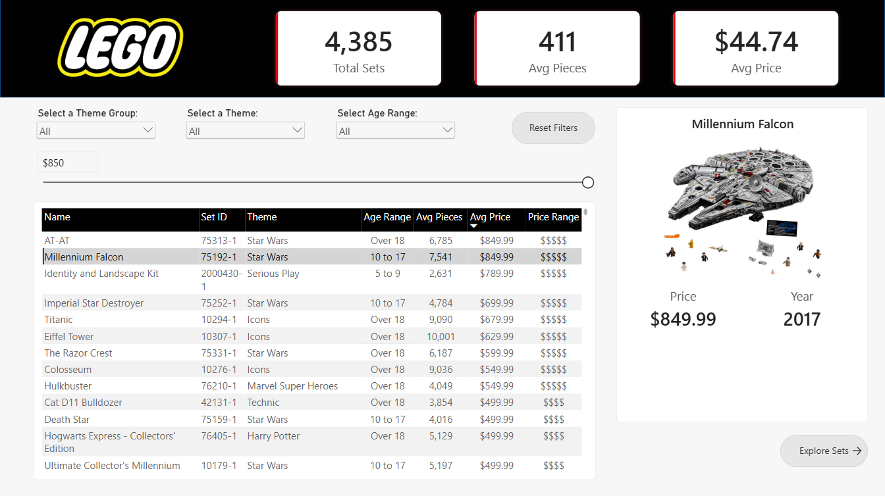
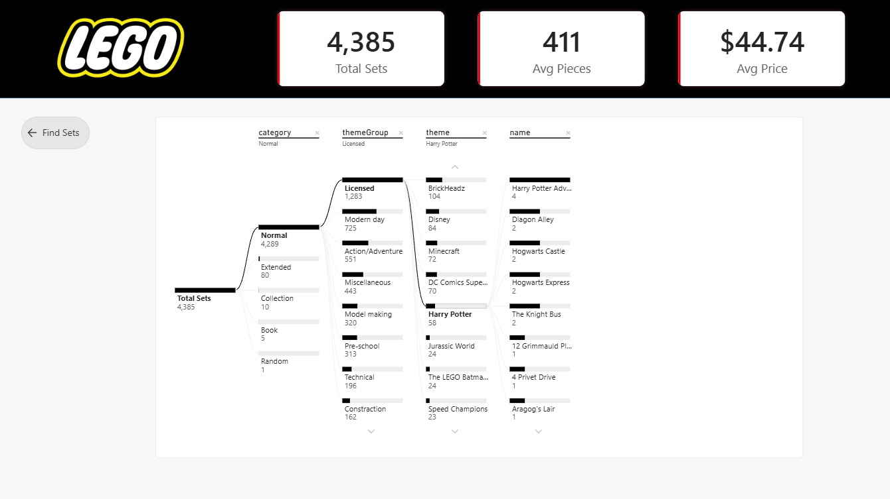

<p align="center">
  
</p>

# 🧱 LEGO Set Explorer (Power BI)

## 🧭 Project Overview

This project is an interactive Power BI report designed to help LEGO collectors explore and evaluate more than 4,000 LEGO sets based on criteria such as theme, number of pieces, age range, and price.

The report allows users to navigate through the LEGO catalog, apply dynamic filters, compare sets, and identify the most suitable options based on their preferences through a combination of interactive visuals, KPIs, and advanced Power BI features.

It was developed as part of the "Advanced Power BI: LEGO Set Explorer" Maven Crash Course by Maven Analytics, in which I take the role of an avid LEGO collector looking for the perfect next set.

---

## 📚 Learning Context

While the course provided a structured walkthrough of the development process, the project gave me the opportunity to practice and better understand several advanced Power BI features, with a strong focus on creating an interactive and user-friendly report experience.

Through this project I practiced and improved skills such as:

* Writing DAX measures for dynamic metrics
* Creating numeric range parameters for flexible filtering
* Designing custom image tooltips
* Building and using decomposition trees
* Creating interactive bookmark actions
* Implementing page navigation
* Designing interactive dashboards
* Applying UI/UX principles to improve the user experience

---

## 📁 Dataset Source

The dataset used in this project was provided as part of the Maven Analytics crash course, which contains information about more than 4,000 LEGO sets. The dataset provides the foundation for exploring the LEGO catalog and identifying sets that match different collector preferences.

---

## 🧩 Data Model

The Power BI report uses a structured data model designed to support interactive analysis of the LEGO catalog.

Key components include:

* LEGO sets dataset containing the core information used throughout the report
* Supporting fields and calculated measures used for filtering, comparison, and visualization
* Numeric range parameters enabling users to dynamically define criteria such as price and number of pieces

The model and measures were structured to allow the report's visuals and interactive components to respond dynamically to user selections.

---

## 🧮 Key Measures (DAX)

The report uses DAX measures to calculate and dynamically display the key metrics used throughout the dashboard.

Some of the main metrics include:

* Total LEGO Sets
* Average Price
* Average Number of Pieces
* Total Pieces

Example DAX measures include:

```DAX
Total Sets = DISTINCTCOUNT(lego_sets[set_id])

Max Price Filter = IF([Avg Price] <= 'Max Price'[Max Price Value], 1, 0)

Selected Set = IF(HASONEVALUE(lego_sets[name]), MAX(lego_sets[name]), "Select a Set")

Selected Price = IF(HASONEVALUE(lego_sets[price]), MAX(lego_sets[price]), "-")
```

These measures allow the report to dynamically update its KPIs and visualizations according to the user's selections and filters.

---

## 🖼️ Dashboard Preview

### Set Finder



### Set Explorer



---

## ✨ Dashboard Features

This Power BI project includes several advanced interactive features:

* **Interactive report navigation using page navigation and bookmark actions**
* **Numeric range parameters for dynamically filtering sets based on numerical criteria**
* **Custom image tooltips providing additional information about individual LEGO sets**
* **Decomposition tree for exploring the factors behind LEGO set characteristics**
* **Interactive slicers and filters for themes, age ranges, prices, and other criteria**
* **Dynamic visualizations that respond to user selections**
* **Custom report layout focused on usability and visual appeal**
* **KPI cards highlighting key LEGO catalog metrics**

These features work together to transform the report from a static dashboard into an interactive LEGO exploration tool.

---

## 🛠️ Tools & Technologies

* **Power BI**
* **DAX**
* **Power Query**
* **Data Modeling**
* **Data Visualization**
